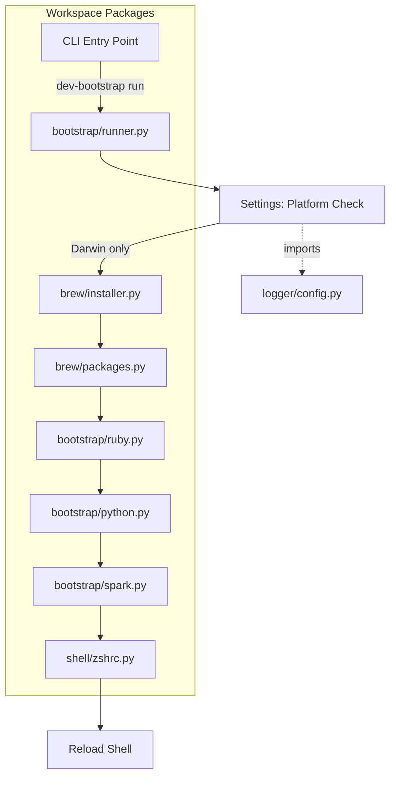
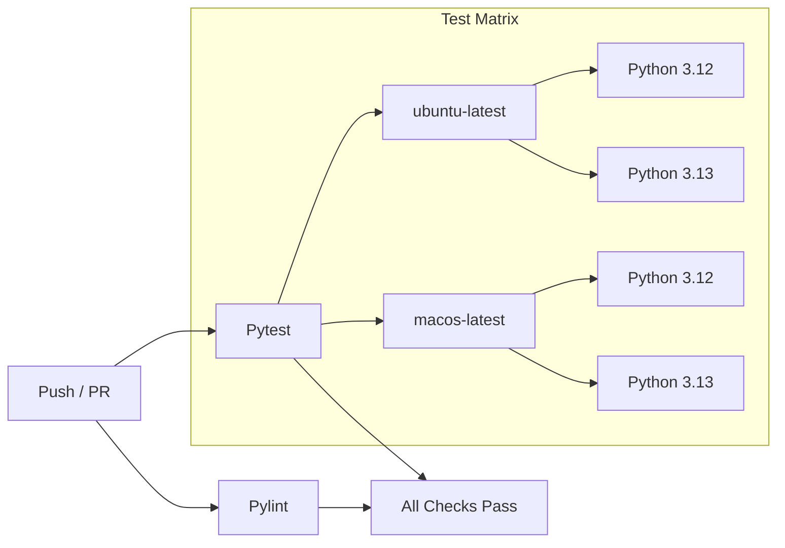
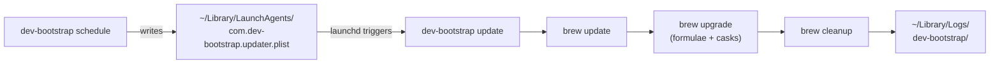

# dev-bootstrap

[](https://github.com/kagaston/scripts/actions/workflows/ci.yaml)
[](https://www.python.org/downloads/)
[](https://github.com/astral-sh/uv)
[](LICENSE)

Modular macOS development environment bootstrap toolkit. Automates Homebrew installation, package management, and shell configuration for a fresh dev machine.

## Architecture



## CI Pipeline



## Project Structure

```
scripts/
├── pyproject.toml              # Root UV workspace config
├── Justfile                    # Task runner
├── .github/workflows/ci.yaml  # CI pipeline
├── development/
│   ├── .pylintrc               # Pylint config
│   └── .pre-commit-config.yaml # Pre-commit hooks
├── .hooks/                     # Git hooks
└── app/
    ├── settings/               # Platform detection, brew paths, package lists
    ├── logger/                 # Structured logging
    ├── brew/                   # Homebrew install, update, cleanup, packages
    ├── shell/                  # Safe ~/.zshrc editing with backup
    ├── bootstrap/              # Ruby, Python, Spark config + orchestrator
    ├── updater/                # Auto-update manager with launchd scheduling
    └── cli/                    # Click CLI entry point
```

## Prerequisites

- macOS (Intel or Apple Silicon)
- [uv](https://docs.astral.sh/uv/) installed
- [just](https://github.com/casey/just) installed (optional, for task running)

## Quick Start

```bash
# Clone the repository
git clone git@github.com:kagaston/scripts.git
cd scripts

# Install all dependencies
just sync
# or: uv sync

# Preview what bootstrap will do (dry-run)
just check
# or: uv run dev-bootstrap check

# Run the full bootstrap
just run
# or: uv run dev-bootstrap run
```

## Available Commands

| Command | Description |
|---------|-------------|
| `just sync` | Install all workspace packages |
| `just test` | Run all tests |
| `just test pkg` | Run tests for a single package (e.g. `just test settings`) |
| `just test-cov` | Run tests with coverage report |
| `just lint` | Run pylint across all packages |
| `just pre-commit` | Run pre-commit hooks manually |
| `just setup-hooks` | Configure git to use project hooks |
| `just run` | Run the full bootstrap process |
| `just check` | Dry-run: preview bootstrap changes |
| `just update` | Update all managed Homebrew packages |
| `just schedule` | Set up auto-updates (default: weekly) |
| `just schedule daily` | Set up daily auto-updates |
| `just unschedule` | Remove the auto-update schedule |
| `just status` | Show auto-update schedule status |

## What Gets Installed

### Homebrew Formulae

`git`, `curl`, `docker`, `ruby`, `perl`, `python`, `sbt`, `apache-spark`

### Homebrew Casks

`temurin` (Eclipse Temurin JDK)

### Shell Configuration

The bootstrap configures `~/.zshrc` with:
- Ruby PATH, LDFLAGS, and CPPFLAGS (platform-aware paths)
- Python aliases (`python` -> `python3`, `pip` -> `pip3`)
- Spark environment variables (auto-detected version)

A backup of `~/.zshrc` is created before any modifications.

## Auto-Update

The toolkit includes a built-in auto-update system that uses macOS LaunchAgent to periodically upgrade all managed Homebrew packages in the background.



```bash
# Set up weekly auto-updates (default)
dev-bootstrap schedule

# Or choose a different interval
dev-bootstrap schedule --interval daily
dev-bootstrap schedule --interval hourly

# Check if auto-updates are active
dev-bootstrap status

# Remove the schedule
dev-bootstrap unschedule

# Run a one-off update manually
dev-bootstrap update

# Preview what an update would do
dev-bootstrap update --dry-run
```

The schedule installs a LaunchAgent plist at `~/Library/LaunchAgents/com.dev-bootstrap.updater.plist`. Update logs are written to `~/Library/Logs/dev-bootstrap/`.

## Development

```bash
# Set up git hooks
just setup-hooks

# Run linting
just lint

# Run tests with coverage
just test-cov
```

## License

[MIT](LICENSE)
